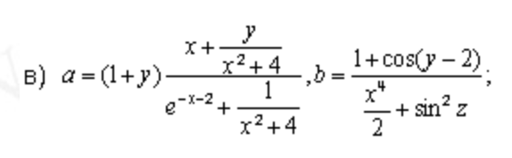
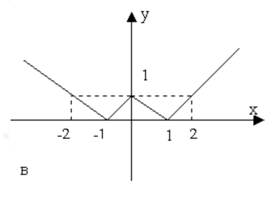
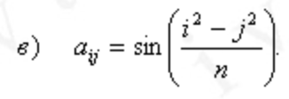
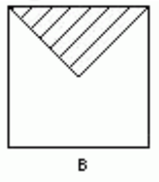

# C-lang-course-tasks

Вариант 3
Делал: Кирилл Д.

---

## Условия задач
1. Даны x, y, z. Вычислить a, b, если

2. Дано действительное число a. Для функции f(x), графики которых представланы на рис.1 а - г, вычислить f(a).

3. Дано натуральное число n (n ≤ 100), определяющее возраст человека (в годах). Дать для этого числа наименования «год», «года» или «лет»: например, 1 год, 23 года, 45 лет и т. д.
4. Дано натуральное число n. Поменять порядок цифр числа n на обратный.
5. Даны натуральное число n,действительные числа a1,..., an. В последовательности a1,...,an все отрицательные члены увеличить на 0.5, а все неотрицательные заменить на 0.1.
6. Даны целые числа a1,..., an (в этой последовательности могут быть повторяющиеся члены). Выяснить, сколько чисел входит в последовательность по одному разу.
7. **TODO** Даны натуральное число n, символы s1,...,sn. Группы символов, разделенные пробелами (одним или несколькими) и не содержащие пробелов внутри себя будем называть словами. Найти количество слов, начинающихся с буквы б.
8.  1. Дано натуральное число n. Выяснить, сколько положительных элементов содержит матрица [aij] i, j = 1, ..., n, если

    2. Даны квадратная матрица А порядка n и вектор b c n элементами. Получить вектор: A^2b
9. 1. Числа Фибоначчи u 0, u 1, u 2, ... определяются следующим образом: u 0 = 0, u 1 = 1, u n = u n-1 + u n-2 (n = 2, 3, ...) (см. задачу 144). Написать программу вычисления u n для данного неотрицательного целого n, включающую рекурсивную процедуру, которая основана на непосредственном использовании соотношения u n = u n-1+u n-2. Доказать по индукции, что при вычислении u n (n = 2, 3, ...) по этой программе придется выполнить u n-1 сложение чисел Фибоначчи. Итак, для нерекурсивной программы количество сложений чисел Фибоначчи при вычислении u n для n = 0, 1, ..., 10 есть соответственно 0, 0, 1, 2, 3, 4, 5, 6, 7, 8, а для рекурсивной - 0, 0, 1, 2, 4, 7, 12, 20, 30, 54. Ввиду последнего обстоятельства никогда не следует пользоваться такого рода рекурсивными процедурами, основанными на непосредственном применении соотношений вида x n = f x n-1, ..., x n-k, k ≥ 2.
    2. Дана действительная квадратная матрица порядка n. Найти наибольшее из значений элементов, расположенных в заштрихованной части матрицы (рис. 39).
    
10. 1. Дан файл f, компоненты которого являются целыми числами. Получить в файле g все компоненты файла f: являющиеся точными квадратами.
    2. **TODO** Сведения об ученике состоят из его имени и фамилии и названия класса (года обучения и буквы), в котором он учится. Дан файл f, содержащий сведения об учениках школы. Выяснить, имеются ли в школе однофамильцы.
11. 1. Даны натуральное число n, действительные числа a1,..., an. Вычислить: |a1| + ... + |an|;
    2. **TODO** Даны натуральное число n, символы s1, ..., sn. Будем рассматривать слова, образованные входящими в последовательность s1, ..., sn символами (см.задачу 269). Ниже описываются преобразования, каждое из которых следует произвести при выполнении указаного условия. Затем последовательность вне зависимости от того, подвергалась она или нет преобразованию, должна быть отредактирована следующим образом. Должны быть удалены группы пробелов, которыми начинается и заканчивается последовательность, а каждая внутренняя группа пробелов должна быть заменена одним пробелом. Преобразования: если общее количество слов больше единицы и нечетно, то удалить первое слово;